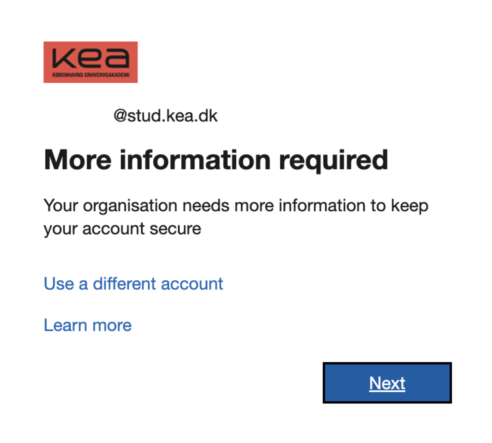
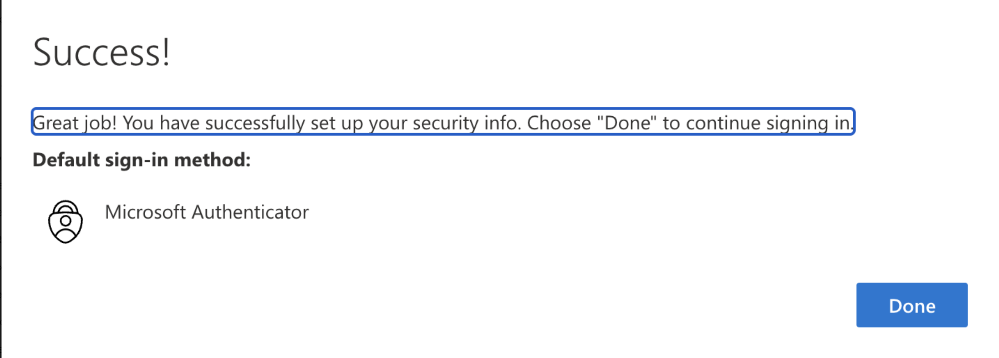
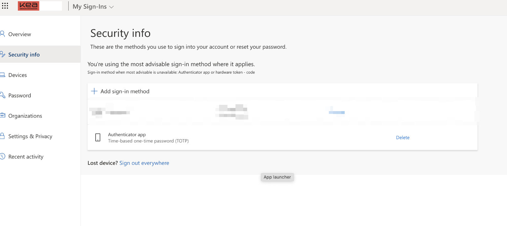

# Azure Oddities

This is not an assignment, but a document for odd behavior experienced in Azure.

---

### Can't work with Azure external to Azure

**Issue**: Getting problems with Service Principal authentication.

**Symptoms**: Can't authenticate Azure in GitHub Actions or can't work with others in the same Azure portal.

**Cause**: KEA has checked off the ability to allow external interaction with Azure. This is done because of concerns for GDPR. It takes a checkbox in order to enable it, but it requires a thorough security assessment also.

**Resolution**: There's nothing that can be done as the security department is blocking us.

---

### The VM was shut down 

**Issue**: VM was shut down by Azure.

**Symptoms**: The VM is no longer accessible.

**Cause**: Though no official source confirm that Azure has a policy of shutting down inactive VMs several students have reported this issue. It usually happens if the VM has been idle for X amount of weeks, for instance during the exam preparation period. It could very well be a KEA Azure policy.

**Resolution**: Start the VM again.

---

### VM restart removes port rules

**Issue**: VM restart cleared all port rules from the network interface.

**Symptoms**: SSH inaccessible after reboot.

**Cause**: Port rules were not persistent across restarts.

**Resolution**: Manually re-add required port rules post-restart.

---

### Can't log in to Azure

**Issue**: Can't log in to Azure. 

**Symptoms**: Stuck in a loop of getting a "More information required" screen. Clicking next shows "Success!" but hitting "Done" returns to the "More information required" screen.

**Cause**: A previously authenticator app is no longer valid.

**Resolution**: Go to https://mysignins.microsoft.com/security-info and delete the authenticator app. Then log in again.

---

<!-- ### 

**Issue**:

**Symptoms**: 

**Cause**:

**Resolution**:

-->