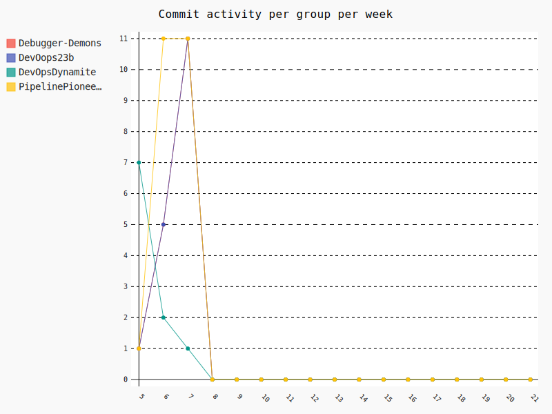
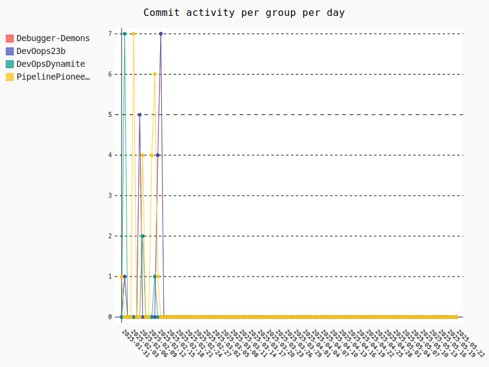

    <h1>Github Actions, Cloud, Azure, Deploy</h1>

---

# Weekly commit activity

<iframe src="./assets_introduction/commit_activity_weekly.svg" style="height: 50vh; width: 100%;" frameborder="0"></iframe>

    

---

# Daily commit activity

<iframe src="./assets_introduction/commit_activity_daily.svg" style="height: 50vh; width: 100%;" frameborder="0"></iframe>

    

---

# Weekly DevOps Principle!

**Reduce WIP (Work In Progress)**

Avoid large batch sizes.

Limit active branches. Merge branches to trunk at least daily.

Avoid long-lived branches.

---

# Simple is always best

Given how simple the frontend is, would React be the right choice?

How does the frontend benefit from a component based web framework?

It's also on me for not properly explaining that the website will not grow in complexity much.

I do not grade higher if you chose a more complex solution when a simpler solution does the job just as well. 

I only value complex solutions if they come with additional benefits such as scalability, maintainability, etc.

Remember, during the exam everything should pass the "*why*" test. 

If you want to put in an extra effort right away, then use that energy on creating tests. Unfortunately, we won't cover that until much later.
