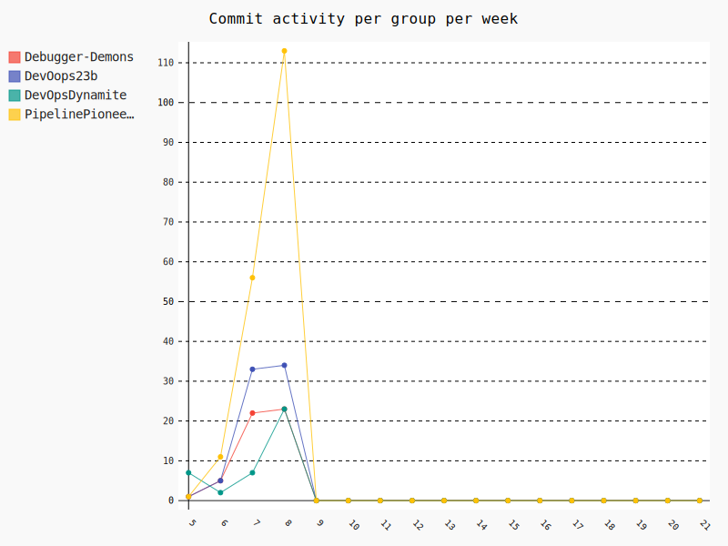
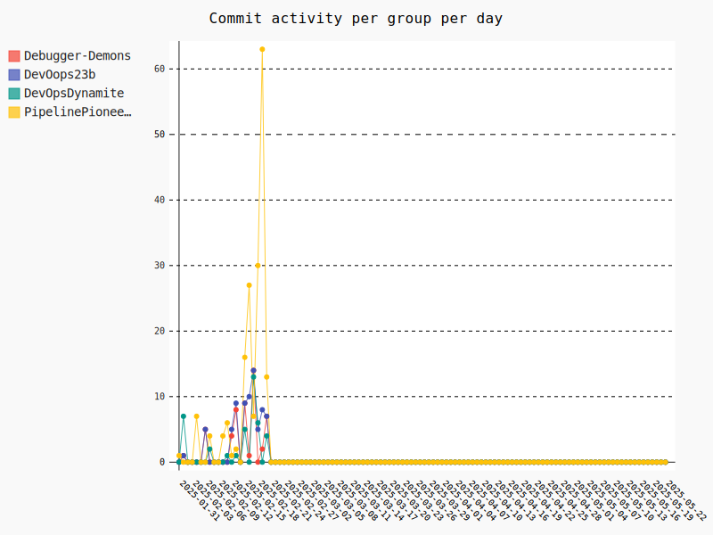

    <h1>Software Quality, Linting, CI</h1>

---

# Weekly commit activity

<iframe src="./assets_introduction/commit_activity_weekly.svg" style="height: 50vh; width: 100%;" frameborder="0"></iframe>

    

---

# Daily commit activity

<iframe src="./assets_introduction/commit_activity_daily.svg" style="height: 50vh; width: 100%;" frameborder="0"></iframe>

    

---

# PR reminder

Remember to criticially engage with the course material. 

This should be easier once you get the `whoknow_variations` assignments. 

---

# Mandatory I

[Mandatory I](https://github.com/who-knows-inc/KEA_DAT_DevOps_2025_Spring/blob/main/00._Course_Material/01._Assignments/00._Mandatories/mandatory_I.md)

Use your energy on the semester project. Use the mandatory to structure and write down your reflections.

---

# Weekly DevOps Principle!

**Collaboration and Communication**

Be nice! Make PRs of a readable size. 

- Instead of a daily standup meeting -> daily PR?

---

# One DevOps definition: CALMS

