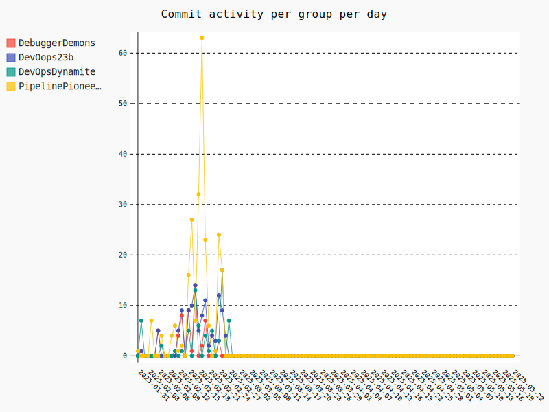

    <h1>Docker, Continuous Delivery, The Simulation</h1>

---

# Not in a group

---

# Weekly commit activity

<iframe src="./assets_introduction/commit_activity_weekly.svg" style="height: 50vh; width: 100%;" frameborder="0"></iframe>

    

---

# Daily commit activity

<iframe src="./assets_introduction/commit_activity_daily.svg" style="height: 50vh; width: 100%;" frameborder="0"></iframe>

    

---

# Do not leak sensitive information

Don't push the SQLite database file into the repository!

We have a database. How do we securely get it to the server is a fun challenge. 

---

# Weekly DevOps Principle!

**Fail fast, recover fast**
