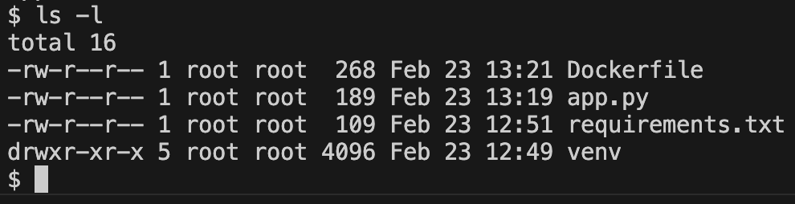

<div class="title-card">
    <h1>The Dockerfile</h1>
</div>

---

# Dockerfile Python example 


```Dockerfile
FROM python:3.9-slim

WORKDIR /usr/src/app

COPY requirements.txt .

RUN pip install --no-cache-dir -r requirements.txt

# Copy all files from current directory to /usr/src/app in container
COPY . .

CMD ["python", "app.py"]
```

*Can you explain each line?*

---

# Dockerfile Node.js example 

```Dockerfile
FROM node

WORKDIR /usr/src/app

COPY package*.json ./

RUN npm install

COPY . .

EXPOSE 8080
CMD [ "npm", "start" ]
```

*Can you explain each line?*

---

# Note on EXPOSE

`EXPOSE` is a way to document the port(s).

It doesn't actually publish the port (make them accessible to the outside). 

[Source](https://docs.docker.com/reference/dockerfile/#expose)

---

# Two ways to start

One runs the file directly. The other runs a start script defined in `package.json` that likely does the first option.

```Dockerfile
CMD ["node", "app.js"]
# AND
CMD ["npm", "start"]
```

---

# Running commands in Dockerfile

RUN can be specified multiple times while CMD and ENTRYPOINT can only be specified once.

```Dockerfile
RUN npm install
```

Two possible syntaxes:

```Dockerfile
CMD ["node", "app.js"]
# OR
CMD node app.js
```

ENTRYPOINT example:

```Dockerfile
ENTRYPOINT ["node", "app.js"]
```

---

# RUN vs CMD vs ENTRYPOINT

**RUN**: Executes during the build phase to set up the image. Can be run multiple times.

**ENTRYPOINT**: Defines the main command to run when the container starts. You can pass flags when running the container.

**CMD**: Provides the default command to execute when starting a container. You can override `CMD` when running the container by adding `node another_app.js` after `docker run <image_name>` for example. 

You can combine the last two:

```Dockerfile
ENTRYPOINT ["node"]
CMD ["app.js"]
```

Which gives the freedom to do the following:

```bash
$ docker run --entrypoint node_runtime_latest <image_name>
$ docker run <image_name> another_app.js
```

---

# Let's set up a Python flask project

Make the folder and create the virtual environment:

```bash
$ mkdir 03._Docker_Python_Project
$ cd 03._Docker_Python_Project
$ python -m venv venv
```

*Nix users:

```bash
$ source ./venv/bin/activate
```

Windows users:

```powershell
$ .\venv\Scripts\activate
```

Install flask and save the dependency:

```bash
$ pip install flask
$ pip freeze > requirements.txt
```

---

# Setup the server

Create a file named `app.py` and in it:

```python
from flask import Flask

app = Flask(__name__)

@app.route('/')
def hello_world():
    return { "data": 'Hello, World!' }

if __name__ == '__main__':
    app.run(host="0.0.0.0", port=8080)
```

Explicitly binding the host to `0.0.0.0` is essential to be able to access the server from outside the container.

---

# Create the `Dockerfile`

```Dockerfile
FROM python

WORKDIR /usr/src/app

COPY requirements.txt ./

RUN pip install --no-cache-dir -r requirements.txt

COPY . .

EXPOSE 8080
CMD ["python", "app.py"]
```

---

# Build and run

Let's name the image `python_project` (remember the period at the end to specify the build context):

```bash
$ docker build -t <image_name> .
```

We want to map both the host port and the container port to `8080`:


```bash
docker run -p <host_port>:<container_port> <image-name>
```

*Can you figure it out?*

---

# Build and run solution

Solution: 

```bash
$ docker build -t python_project .
$ docker run -p 8080:8080 python_project
```

Combined:
    
```bash
$ docker build -t node_project . && docker run -p 8080:8080 python_project
```


---

# Dockerfile create a non-root user for privilege separation

```Dockerfile
FROM python

RUN adduser --system --home /home/appuser appuser

WORKDIR /usr/src/app

COPY requirements.txt ./

RUN pip install --no-cache-dir --upgrade pip && pip install --no-cache-dir -r requirements.txt

COPY . .

USER appuser

EXPOSE 8080
CMD ["python", "app.py"]
```

---

# Check user

Run it with an interactive shell:

```bash
$ docker build -t python_project .
$ docker run -it --rm python_project /bin/sh
```

See the user:

```bash
$ whoami
appuser
```

Check out who owns the files:

```bash
$ ls -l
```



Not surprising but in other languages and with other user configuration you might run into issues such as ownership and certain users not being able to access files.

---

<div class="title-card">
    <h1>.dockerignore</h1>
</div>


---

# .dockerignore


*What are files and folders to ignore?*

---

# `.dockerignore` possible python template

```plaintext
**/.git
**/.gitignore
**/.vs
**/.vscode
**/__pycache__
**/*.pyc
**/*.pyo
**/*.pyd
**/*.db
**/*.sqlite
**/.venv
**/venv
**/env
**/.mypy_cache
**/.pytest_cache
**/.coverage
**/htmlcov
**/logs
**/secrets.dev.yaml
**/values.dev.yaml
```

Let's add it to the project.

---

<div class="title-card">
    <h1>Docker layers</h1>
</div>

---


# Docker layers

Each image consists of a layer. 

When you build an image, Docker creates a new layer for each instruction in the Dockerfile. 

When you change the Dockerfile and rebuild the image, only the layers that have changed are rebuilt.

Inspect the layers with:

```bash
$ docker history <image-name>
```

---

# Docker layers optimization

When building an image, Docker will only execute instructions from top to bottom. But it only executes the instructions that have changed.

Otherwise it will reuse the layers from the cache.

This file is not optimized. *How can we use Docker's caching mechanism more efficiently?*

```Dockerfile
FROM node

WORKDIR /usr/src/app

COPY . .

RUN npm install

EXPOSE 8080

CMD [ "node", "app.js" ]
```

---

# Improved Dockerfile

If there is no change to `package.json` then there is no need to run `npm install` again.  

```Dockerfile
FROM node

WORKDIR /usr/src/app

COPY package*.json ./

RUN npm install

COPY . .

EXPOSE 8080

CMD [ "node", "app.js" ]
```

---

# Dockerfile optimization result


