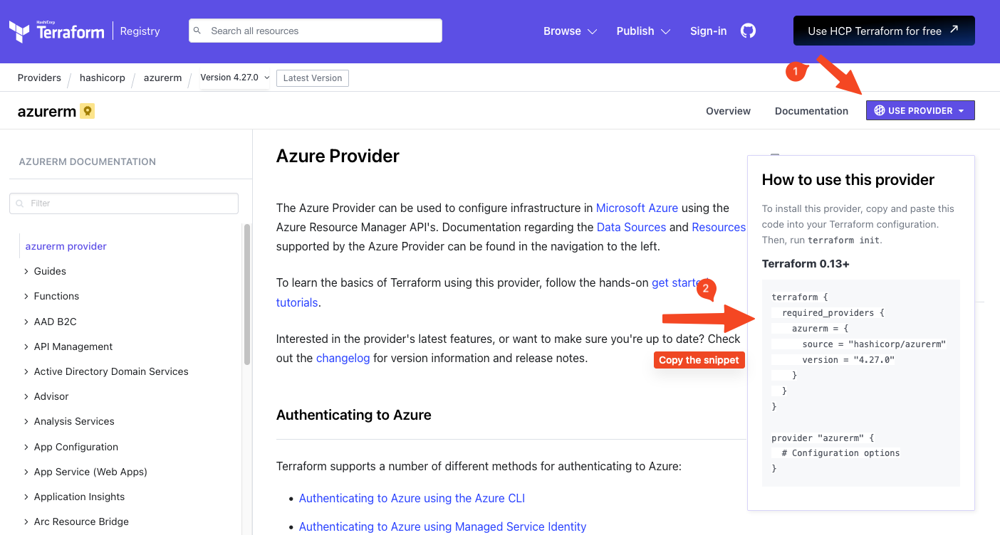

<div class="title-card">
    <h1>Terraform - Get Started</h1>
</div>

---

# Install and log in to `az`

`az` is the Azure CLI. By logging in locally Terraform can get access to our cloud.

https://developer.hashicorp.com/terraform/tutorials/azure-get-started/azure-build

```bash
$ az login
```

Verify the login:

```bash
$ az account show
```

---

# Clarification: Terraform under the hood

Though possible to provision everything through `az`, this is not how Terraform does it.

Terraform uses `az` to generate a user token for authorization.

This token is used to validate against what they call [Azure REST API](https://learn.microsoft.com/en-us/rest/api/azure/).

---

# Install Terraform

https://developer.hashicorp.com/terraform/install?product_intent=terraform

Success criterion: You can run the following and see the version number:

```bash
$ terraform --version
```

---

# Suggestions for later 1: Install auto-completion for Terraform

Install terraform auto-complete (tab completion) for your terminal:

https://developer.hashicorp.com/terraform/tutorials/azure-get-started/install-cli#enable-tab-completion

---

# Suggestions for later 2: Alias `terraform` as `tf`

Alias the `terraform` command so that you can invoke it by simply typing `tf`.

This is pretty standard practice for Terraform users.

***nix**: 

Write `alias tf="terraform"` in the terminal and it will work in the session.

For a more permanent solution add this to your terminal's rc file (such as ~/.bashrc, ~/.zshrc).

**Windows**: Create a terminal profile if it doesn't exist, in either case open it

```powershell
$ if (!(Test-Path -Path $PROFILE)) { New-Item -ItemType File -Path $PROFILE -Force }
notepad.exe $PROFILE
```
You can now manually add this line to it and save:

```powershell
Set-Alias -Name tf -Value terraform
```

---

<div class="title-card">
    <h1>First Terraform project - Let's test it out</h1>
</div>

---

# Let's create our first Terraform project

In an empty folder run:

```bash
$ terraform init
```

It is missing a configuration file. Let's create `main.tf`. Then run init again.

---

# .tf files and VSCode Extensions

The `.tf` file extension is used for Terraform. In VSCode there are extensions for syntax highlighting and Intellisense. 

The official one by Hashicorp seems to be universally hated. Instead, consider the one that is higher rated.


---


<div class="title-card">
    <h1>Terraform Workflow</h1>
</div>

---

# Terraform workflow - I


Source: https://developer.hashicorp.com/terraform/tutorials/azure-get-started/infrastructure-as-code

---

# Terraform Planning

During the planning, Terraform tries to assess the current state and find out how to get to the desired state. 

It creates a dependency graph of all resources and the order that they must be created in.

*When creating a virtual machine in Azure what ressources need to be created and in what order?*

<details> 
  <summary>Hint - How many are needed</summary>
   8 resources need to be created.
</details>


---

# Virtual Machine Resource Creation and Order

1. Resource Group

2. OS Disk

3. Virtual Network

4. Subnet

5. Network Security Group

6. Public IP

7. Network Interface

8. Virtual Machine


---

# Terraform commands - overview

| Command                | Description                                          |
|------------------------|------------------------------------------------------|
| `terraform init`       | Initializes a Terraform configuration directory. Prepares your directory for other commands, installs necessary providers. |
| `terraform plan`       | Shows a preview of the actions Terraform plans to take based on the configuration files. Useful for reviewing changes before applying them. |
| `terraform apply`      | Applies the changes described by `terraform plan`. Provisions or updates infrastructure according to the Terraform configuration. |
| `terraform destroy`    | Removes all resources defined in the Terraform configuration, tearing down the managed infrastructure. |
| `terraform fmt`        | Automatically formats Terraform configuration files to a canonical format and style. |
| `terraform validate`   | Validates the syntax of the Terraform configuration files for correctness. |
| `terraform output`     | Displays the output variables defined in the configuration, useful for extracting important information like IP addresses. |
| `terraform refresh`    | Updates the local state file against real-world resources, realigning the state with the actual state of resources in the cloud. |
| `terraform import`     | Brings real-world infrastructure into Terraform management by adding it to the Terraform state file. |
| `terraform workspace`  | Manages different workspaces, allowing for managing separate states for the same configuration, useful for different environments (e.g., staging, production). |


---


# Terraform workflow - II

Let's look at the previous table again. 

*Can you spot a command and guess which stage they relate to?*


Source: https://developer.hashicorp.com/terraform/intro


---

# Let's add the Azure Provider

1. Get the Azure Provider snippet in the [provider docs](https://registry.terraform.io/providers/hashicorp/azurerm/latest/docs). 

    

2. Paste it in the `main.tf` file. 

3. Run the following to download initialize which downloads the provider locally:

```bash
$ terraform init
```

*What was created?*

---

# Terraform `.gitignore`

The provider is a large file which will cause problems if pushed to git

Add Terraform templates to your `.gitignore`. Find one by searching for Terraform in [gitignore.io](http://www.gitignore.io):

This will also ensure that no Terraform secrets (like the state file) are pushed to git.

---

# [Optional step] Format

Formatting will make your code look nicer: 

```bash
$ terraform fmt
```

---

# Azure Virtual Machine with hardcoded and visible password

Our end goal is to move away from hardcoded passwords. This is not our final version.

To ensure that we have the latests version, delete the first block below and replace the `required_providers` it with the one you got from the provider page.

```hcl
terraform {
  required_providers {
    azurerm = {
      source  = "hashicorp/azurerm"
      version = "4.27.0"
    }
  }
}

provider "azurerm" {
    features {}
    subscription_id = "00000000-0000-0000-0000-000000000000"
}

resource "azurerm_resource_group" "terraform_class" {
  name     = "terraform_class-resources"
  location = "North Europe"
}

resource "azurerm_virtual_network" "terraform_class" {
  name                = "terraform_class-vnet"
  address_space       = ["10.0.0.0/16"]
  location            = azurerm_resource_group.terraform_class.location
  resource_group_name = azurerm_resource_group.terraform_class.name
}

resource "azurerm_subnet" "terraform_class" {
  name                 = "internal"
  resource_group_name  = azurerm_resource_group.terraform_class.name
  virtual_network_name = azurerm_virtual_network.terraform_class.name
  address_prefixes     = ["10.0.2.0/24"]
}

resource "azurerm_public_ip" "terraform_class" {
  name                = "terraform_class-publicip"
  location            = azurerm_resource_group.terraform_class.location
  resource_group_name = azurerm_resource_group.terraform_class.name
  allocation_method   = "Static"
}

resource "azurerm_network_interface" "terraform_class" {
  name                = "terraform_class-nic"
  location            = azurerm_resource_group.terraform_class.location
  resource_group_name = azurerm_resource_group.terraform_class.name

  ip_configuration {
    name                          = "internal"
    subnet_id                     = azurerm_subnet.terraform_class.id
    private_ip_address_allocation = "Dynamic"
    public_ip_address_id          = azurerm_public_ip.terraform_class.id
  }
}

resource "azurerm_linux_virtual_machine" "terraform_class" {
  name                = "main-vm"
  resource_group_name = azurerm_resource_group.terraform_class.name
  location            = azurerm_resource_group.terraform_class.location
  size                = "Standard_B1s"
  admin_username      = "adminuser"
  network_interface_ids = [
    azurerm_network_interface.terraform_class.id,
  ]
  os_disk {
    caching              = "ReadWrite"
    storage_account_type = "Standard_LRS"
  }
  source_image_reference {
    publisher = "Canonical"
    offer     = "0001-com-ubuntu-server-jammy"
    sku       = "22_04-lts-gen2"
    version   = "latest"
  }

  disable_password_authentication = false
  admin_password                  = "badpasword1!"

}

resource "azurerm_network_security_group" "terraform_class_nsg" {
  name                = "terraform_class-nsg"
  location            = azurerm_resource_group.terraform_class.location
  resource_group_name = azurerm_resource_group.terraform_class.name

  security_rule {
    name                       = "allow-8080"
    priority                   = 100
    direction                  = "Inbound"
    access                     = "Allow"
    protocol                   = "Tcp"
    source_port_range          = "*"
    destination_port_range     = "8080"
    source_address_prefix      = "*"
    destination_address_prefix = "*"
  }
}

resource "azurerm_network_security_rule" "terraform_class_ssh_rule" {
  name                        = "SSH"
  priority                    = 1000
  direction                   = "Inbound"
  access                      = "Allow"
  protocol                    = "Tcp"
  source_port_range           = "*"
  destination_port_range      = "22"
  source_address_prefix       = "*"
  destination_address_prefix  = "*"
  network_security_group_name = azurerm_network_security_group.terraform_class_nsg.name
  resource_group_name         = azurerm_resource_group.terraform_class.name
}
```


---

# Terraform Validate + Plan

```bash
$ terraform validate
$ terraform plan
```

*What happens?*

---

# Subscription ID

Seeing how one command passed while the other didn't shows the difference between validation and planning. One is to check the syntax and internal consistency. The other is to check execution logic.

We are missing the subscription ID. Get it by running:

```bash
$ az account show
```

The `id` field is the subscription ID.

In the `main.tf` file, replace the subscription ID to the provider block:

```hcl
provider "azurerm" {
    features {}
    subscription_id = "00000000-0000-0000-0000-000000000000"
}
```

**Note**: This is another thing that we do not wish to hardcode and push.

---

# Terraform Apply

Running apply will give you an overview once again. Type `yes` to enact them:

```bash
$ terraform apply
```

Once finished look for this line and the numbers instead of X, Y, Z:

```
Apply complete! Resources: **X** added, **Y** changed, **Z** destroyed.
```

---

# Can we SSH into it?

Go into the Azure portal and check if the VM is running. Copy the `ip_address` and try to SSH into it:

```bash
$ ssh adminuser@<ip_address>
```

Enter the password as defined in the `main.tf` file.

---

# Create a `outputs.tf` file

Wouldn't be neat if we could get some dynamic information after applying? 

We can define that if we create a file named exactly `outputs.tf` in the same directory as the `main.tf` file.

```hcl
output "public_ip_address" {
  value = azurerm_public_ip.terraform_class.ip_address
}

output "ssh_command" {
  value = "ssh ${azurerm_linux_virtual_machine.terraform_class.admin_username}@${azurerm_public_ip.terraform_class.ip_address}"
}
```

Then run apply again:

```bash
$ terraform apply
```

---

# Visualizing the Dependency Graph

Combining Terraform and GraphViz, you can actually visualize the graph:

```bash
$ terraform graph | dot -Tpng > graph.png
```

Resulting in a graph like this:


---

# The Files of Terraform

Let's look at the files that Terraform created:

| File Type              | Description                                           |
|------------------------|-------------------------------------------------------|
| `*.tf` / `*.tf.json`   | Infrastructure definitions in HCL or JSON.            |
| `*.tfvars` / `*.tfvars.json` | Variable definitions for configurations.                |
| `.terraform.lock.hcl` | Tracks provider versions and dependencies.            |
| `outputs.tf`           | Defines output values from Terraform.                 |
| State Files (`terraform.tfstate`, `terraform.tfstate.backup`) | Maps configurations to real-world resources.            |


---

# Work with variables

Create a `variables.tf` file (named exactly that and in the same directory as the `main.tf` file):

```hcl
variable "vm_name" {
  description = "The name of the virtual machine"
  type        = string
  default     = "main-vm"
}

variable "vm_size" {
  description = "The size of the virtual machine"
  type        = string
  default     = "Standard_B4ms"
}
```

In `main.tf` replace the hard-coded values with the two variables like this:

```hcl
var.vm_name
var.vm_size
```

*Can you figure out where to replace with variables?*


---

# Replace password authentication with SSH key

<!-- todo -->

---

# Add a remote provisioner

This is not what you should use Terraform for, but it will be useful for your projects.

Inside of the `azurerm_linux_virtual_machin` block, add the following:

```hcl
  provisioner "remote-exec" {
    inline = split("\n", templatefile("${path.module}/inline_commands.sh", {}))

    connection {
      type        = "ssh"
      user        = "adminuser"
      private_key = file("~/.ssh/id_rsa")
      host        = self.public_ip_address
      timeout     = "2m"
    }
  }
```

---

# Create a `inline_commands.sh` file

Make sure that there are no empty lines as they will not be valid shell commands.

The echo commands are because you cannot pass comments to the shell. 

```bash
echo "============================================================================================"
echo "Update packages"
echo "============================================================================================"
sudo apt-get update && sudo apt-get install -y software-properties-common
echo "============================================================================================"
echo "Install Docker and give user permission"
echo "============================================================================================"
sudo apt install -y docker.io
sudo usermod -aG docker $(whoami)
sudo systemctl restart docker
sudo apt install -y docker-compose
```

---

# Time to destroy

This will tear down your cloud services provisioned by Terraform:

```bash
$ terraform destroy
```

As mentioned earlier, the smart thing about Terraform is that they take care of the dependency graph 
and will shut down services in the necessary order. 

*Verify in Azure Portal that it is gone.*

---

<div class="title-card">
    <h1>Terraform Workspaces</h1>
</div>

---

# Workspaces

Similar to branches. Each workspace is its own context. 

Type the following to see the possible options:

```bash
$ terraform init
$ terraform workspace
```

*Using the help menu, can you solve the assignment?* 

## Assignment:

1. List workspaces.
2. Create a new workspace called `dev` and one named `prod`.
3. Select the `dev` workspace.
4. Show the current workspace.
5. Select the `prod` workspace.

**Bonus Question**: *What keeps track of what the current workspace is?*

---

# Solution: Working with workspaces

```bash
$ terraform workspace list
$ terraform workspace new dev 
$ terraform workspace new prod
$ terraform workspace select dev
$ terraform workspace show
$ terraform workspace select prod
```

---


# Why workspaces in Terraform?

*Consider why...*

---

# Why workspaces in Terraform?

Besides having different environments like `dev`/ `test` / `prod`, you can also create sandboxes for each developer. 

Because each workspace maintains its own state, allowing for isolated management of resources.

The state is kept in `terraform.tfstate`file inside of the `terraform.tfstate.d` directory. 

Try to observe how the file changes as you switch between workspaces. 

It requires a project where you have actually provisioned resources. 

Knowing about workspaces is useful but you are not expected to use them in this course.


