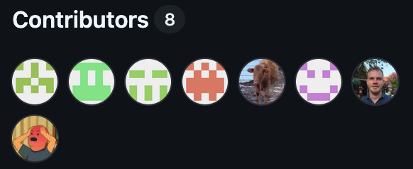

    <h1>DevOps course conclusion</h1>

---

# The simulation is over!

---

# The repo will be made unavailable after the first exam

Remember to fork the repo if you want it.

---

# Learning Goals

Remember to check the learning goals for the course and make sure that you have achieved them.

It's a good measure of my expectation for the exam.

---

# Let's look at the exam report requirements and exam requirements

They can be found as links at the top of the semester plan.

---

# Do you agree with this? React to it only if you do

https://github.com/orgs/community/discussions/114734

---

# Thank you, Contributors!

https://github.com/who-knows-inc/KEA_DAT_DevOps_2025_Spring/graphs/contributors

https://github.com/who-knows-inc/KEA_DAT_DevOps_2025_Spring/network

---

# Course Survey

---

# Did we learn Devops - A historical overview

Compilation of blog posts and articles of historical importance:

https://gist.github.com/jpswade/4135841363e72ece8086146bd7bb5d91

---

# Did we learn Devops - Roadmap

This is a famous roadmap for DevOps:

This course was not developed with it in mind but see how much of it we have achieved:

https://roadmap.sh/devops

---

# DevOps course as DevOps

This course has aimed to be DevOps!

Examples:

* IaC: First weeks server and the simulation.

* Various Github Actions. 

* Monitoring of student activity, 

* Behind-the-scenes monitoring of the simulator.

* Continuous improvement of the course.

---

# Debois' definition of DevOps

> *It's taken me 10-plus years to come up with my own one-line definition of DevOps:*

> ***"DevOps is whatever you do to bridge friction created by silos, and all the rest is engineering."***

> *And so, if you're doing technology just for the technology and you're not trying to overcome some friction of the human kind of siloing or group siloing or information siloing or whatever, then you're just doing the engineering part and you're not, in my opinion, doing the DevOps part."*

\- Patrick Debois

---

# Were you DevOps?

The big exam question: *Were you DevOps?*

While you have to ask yourselves if you were DevOps you should also ask if you did what was best for your team in the context of the course.

DevOps offers a solution to common problems. 

---

# Was I DevOps?

DevOps shouldn't be the end goal. 

It's about continuous improvement. 

I hope you can use this in your general life. 

